# OBS: As imagens serão carregadas amanhã 09/01/2025

# Dicas de Estudo

## Índice

1. [Potencialize Seus Estudos com ANKI e o Método da Curva de Esquecimento!](#potencialize-seus-estudos-com-anki-e-o-método-da-curva-de-esquecimento)
2. [Como Instalar, Configurar e Estudar com o ANKI de Forma Eficiente!](#como-instalar-configurar-e-estudar-com-o-anki-de-forma-eficiente)
3. [Como Criar Baralhos para o ANKI com Ajuda da OpenAI🚀](#como-criar-baralhos-para-o-anki-com-ajuda-da-openai)
4. [Usando IA como Ferramenta de Aprendizado na Programação](#usando-ia-como-ferramenta-de-aprendizado-na-programação)

---

## Potencialize Seus Estudos com ANKI e o Método da Curva de Esquecimento!

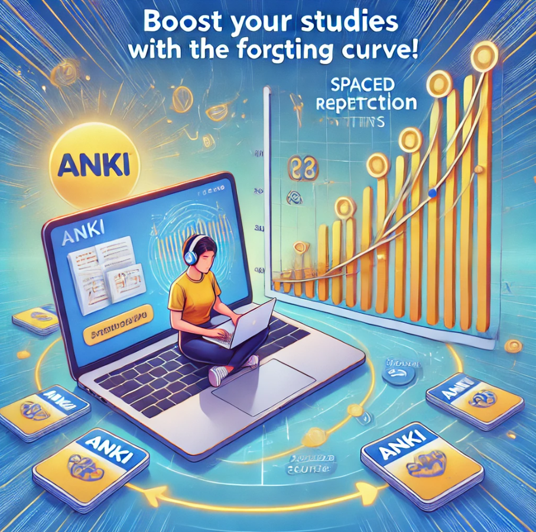

Você já se pegou estudando um conteúdo e, dias depois, não consegue lembrar de quase nada? Isso acontece com todos nós e é onde entra o conceito da Curva de Esquecimento. Esse fenômeno, proposto pelo psicólogo Hermann Ebbinghaus, mostra que esquecemos informações rapidamente após aprendê-las, a menos que revisemos de forma eficaz.

É aqui que o ANKI se torna um aliado poderoso nos seus estudos! ANKI é um software de flashcards que utiliza o método de repetição espaçada, uma técnica que se baseia na Curva de Esquecimento. Mas como isso funciona?

### O que é Repetição Espaçada?

A repetição espaçada é uma técnica que envolve revisar o material em intervalos crescentes. Em vez de estudar intensamente por longos períodos, você revisa o conteúdo em momentos estratégicos, o que ajuda a reforçar a memória e a retenção a longo prazo.

### Como o ANKI Ajuda?

**Personalização:** Com o ANKI, você pode criar seus próprios flashcards, adaptando o conteúdo ao seu estilo de aprendizado. Isso significa que você pode focar nas áreas que mais precisa revisar.

**Algoritmo Inteligente:** O ANKI utiliza um algoritmo que determina quando você deve revisar cada flashcard, com base no seu desempenho anterior. Se você acertou uma resposta, o intervalo até a próxima revisão será maior. Se errou, o ANKI irá apresentar o cartão novamente em breve. Isso maximiza a eficiência do seu estudo!

**Acesso em Qualquer Lugar:** O ANKI está disponível em várias plataformas, permitindo que você estude a qualquer hora e em qualquer lugar. Isso é perfeito para aproveitar momentos livres no dia a dia.

**Visualização de Progresso:** O ANKI oferece estatísticas sobre seu desempenho, permitindo que você visualize seu progresso e ajuste seu estudo conforme necessário.

### Conclusão

Se você deseja melhorar sua retenção de informações e otimizar seus estudos, o ANKI é uma ferramenta indispensável. Ao combinar o poder da repetição espaçada com a flexibilidade dos flashcards, você pode vencer a Curva de Esquecimento e transformar seu aprendizado em uma experiência mais eficaz e duradoura.

Experimente o ANKI e veja como ele pode revolucionar sua forma de estudar! 🚀

---

## Como Instalar, Configurar e Estudar com o ANKI de Forma Eficiente!

📚 Quer aprender a instalar e configurar o ANKI para estudar de forma mais eficiente? Siga o passo a passo que preparei abaixo:

### Instalação e Configuração no Computador

1. **Baixe o ANKI:** A configuração inicial do ANKI é feita pelo computador, pois é ideal para estudar com mais foco. Acesse o site oficial do ANKI, baixe a versão do programa compatível com seu sistema e faça a instalação no seu idioma preferido.
2. **Criação da Conta no ANKIWeb:**
   - Assim que abrir o programa, acesse ankiweb.net para criar sua conta. Essa conta será usada para sincronizar seus decks na nuvem, o que permite acessar seus flashcards no celular e manter tudo atualizado.
   - Verifique seu e-mail para ativar a conta e, depois, volte ao programa ANKI no seu computador.
4. **Configuração de Perfil:**
   - No ANKI, vá ao menu superior, clique em "Arquivo" e selecione "Mudar Perfil".
   - Renomeie o perfil atual com seu nome ou crie um novo perfil. Essa etapa é importante para organizar seus estudos e personalizar a experiência.

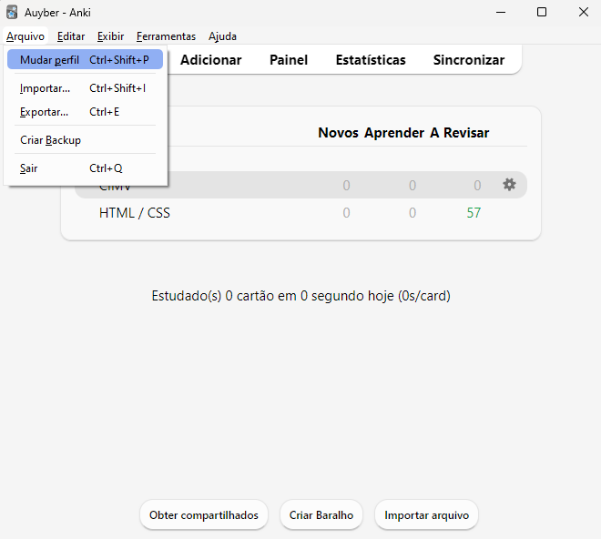

4. **Sincronização:**
   - No menu superior, clique em "Sincronizar" e faça login com o e-mail e senha da sua conta ANKIWeb.
   - Se for sua primeira vez usando o ANKIWeb, aparecerá uma mensagem perguntando se deseja "Baixar do AnkiWeb" ou "Enviar para o AnkiWeb". Se não houver cartas em sua conta online, clique em "Baixar". Caso já tenha decks criados, clique em "Enviar" para sincronizar e salvar todos os seus flashcards.

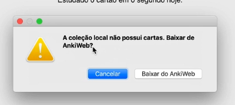

### Criando e Configurando Seus Decks

1. **Crie seu Deck de Estudo:**
   - No ANKI, crie um novo deck e renomeie de acordo com o tema ou área de estudo, por exemplo, "HTML/CSS". Essa personalização facilita a organização dos conteúdos.

2. **Configuração Avançada do Deck:**
   - Clique no ícone de engrenagem ao lado do deck recém-criado e selecione "Opções".
   - Na janela de opções, verá a configuração "Padrão" ou "Default". Clique ao lado dela, selecione "Adicionar Predefinição" e escolha um nome que identifique esse ajuste.

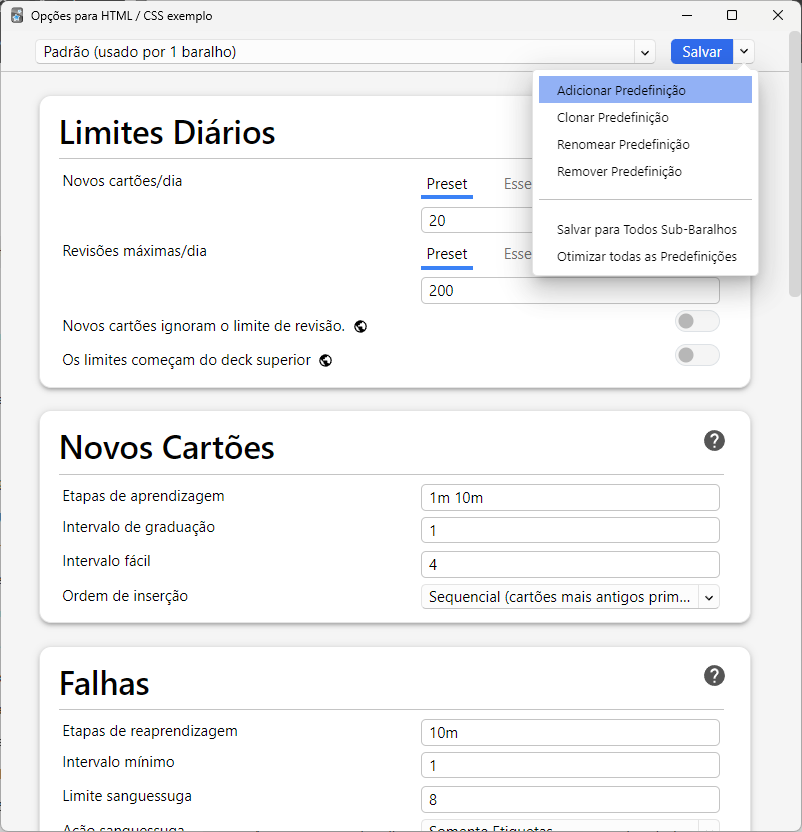

3. **Ajustando as configurações da Predefinição:**
   - Na seção "Limites Diários", altere os valores de "Novos cartões/dia" e "Revisões máximas/dia" para 9999. Esse ajuste garante que não haverá limites no número de cartas que pode revisar ou adicionar diariamente.
   - Role até a parte "Avançado" e ajuste o "Novo Intervalo" para 0,50. Isso ajuda a espaçar os intervalos de revisão conforme seu desempenho. Clique em "Salvar" para concluir.

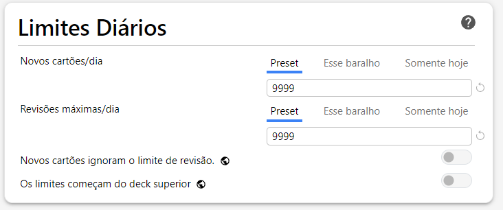
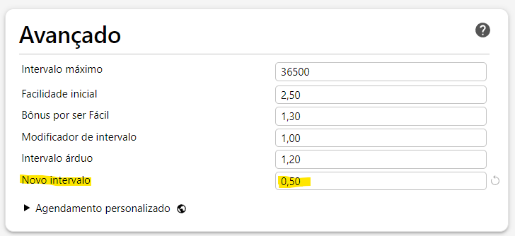

4. **Aplicando a Predefinição em Outros Decks:**
   - Quando criar novos decks, basta clicar na engrenagem ao lado do deck, ir em "Opções" e selecionar a predefinição que você configurou para manter as mesmas configurações.

### Como Adicionar Cartões no ANKI

1. **Criando Cartões:**
   - Acesse seu deck e clique em "Adicionar". Na tela de adição de cartões, você verá os campos "Frente" e "Verso".
   - Na Frente (front), insira a pergunta ou termo que deseja memorizar. No Verso (back), coloque a resposta ou explicação detalhada.
   - Para o estudo de inglês, por exemplo, insira a frase em inglês na frente e a tradução no verso. Também é possível arrastar áudios para reforçar a memorização auditiva.

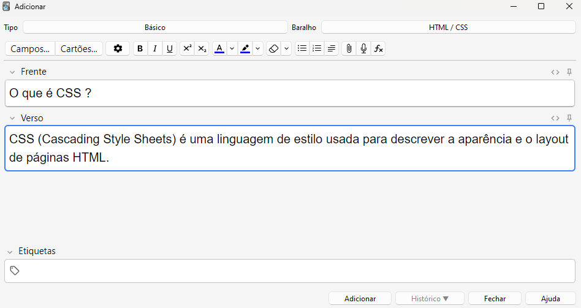

### Como Estudar com o ANKI

1. **Estudando seus Decks:**
   - Clique em "Estudar Agora" no seu deck.
   - Quando ver a pergunta, se lembrar da resposta corretamente, clique em "Mostrar Resposta" e veja se acertou.
   - Se acertou, clique em "Bom". Caso tenha demorado ou errado a resposta, clique em "De Novo". Evite utilizar as opções "Fácil" e "Difícil", pois isso pode alterar o algoritmo do ANKI de maneira não ideal, causando um aumento exagerado de revisões ou espaçamento ineficiente.
  
2. **Dicas para Responder:**
   - Para o estudo de inglês, se lembrar da frase em inglês, clique em "Bom". Se não lembrar ou demorar, clique em "De Novo".
   - Em perguntas ou conteúdos teóricos, aplique a mesma lógica: se souber de imediato, clique em "Bom"; caso contrário, clique em "De Novo". Isso otimiza o espaçamento das revisões e melhora a eficiência de aprendizado.

3. **Finalizando o Estudo:**
   - Estude até que o ANKI mostre a mensagem "Parabéns! Você terminou este baralho por enquanto." Isso indica que revisou todas as cartas necessárias do dia.

4. **Estudo Diário:**
   -Todos os dias, abra o ANKI para ver se há novas cartas a serem revisadas. Em alguns dias, pode não haver revisões, então aproveite esse tempo para continuar com outros conteúdos.

### Estudo pelo Celular (APK ANKI)

Para estudar pelo celular, baixe o aplicativo ANKI, faça login com a mesma conta do ANKIWeb e sincronize seus decks. Lembre-se de que a configuração e a adição de novas cartas são mais fáceis pelo computador, então utilize o app apenas para revisar em momentos em que não estiver perto do PC.

Boa sorte e bons estudos!

Espero que essas dicas ajudem a transformar seu aprendizado!

---

## Como Criar Baralhos para o ANKI com Ajuda da OpenAI🚀

Quer aprender a criar flashcards para o ANKI de forma rápida e eficiente? Com o auxílio da OpenAI, você pode gerar conteúdo de estudo com facilidade, especialmente útil para temas complexos ou para quando você está sem tempo para montar os cartões manualmente. Veja a seguir o passo a passo para criar baralhos personalizados e, no final, um exemplo prático!

### Passo a Passo para Criar Flashcards com a OpenAI

1. **Introduza a OpenAI na Criação dos Flashcards:** Explique ao assistente que você é estudante e utiliza flashcards para revisar o conteúdo. Com o comando certo, você pode solicitar que a OpenAI gere as perguntas e respostas que se tornarão seus flashcards.
   
2. **Forneça o Tema e os Detalhes:** Para obter cartões precisos e bem elaborados, envie um trecho do conteúdo que deseja estudar ou apenas indique o tema. A IA pode interpretar o material e criar flashcards curtos e pontuais com base nas suas necessidades.
   
3. **Solicite o Formato em CSV:** Para facilitar a importação dos cartões para o ANKI, peça que o conteúdo gerado seja formatado em CSV. Esse formato permite uma importação rápida, onde cada linha se torna um novo flashcard, pronto para ser revisado.
   
### Prompts para a Criação de Flashcards

1. **Prompt 1:** "Sou estudante de [sua área] e estudo com flashcards no ANKI. Você pode me ajudar criando flashcards curtos e objetivos sobre um tema específico que estou estudando?"
   
2. **Prompt 2:** "Crie para mim alguns flashcards objetivos com base no texto ou assunto a seguir: [insira seu texto ou tema aqui]."
   
3. **Prompt 3:** "Preciso que você insira esses flashcards em formato CSV sendo a pergunta a primeira coluna e a resposta a segunda coluna, use ponto e vírgula para separar uma coluna da outra."

Você também pode solicitar o arquivo CSV para download.

### Exemplo Prático: Criando Flashcards de HTML

Para facilitar o entendimento, aqui está um exemplo prático usando o tema HTML. Imagine que você queira estudar conceitos básicos de HTML. Siga o fluxo com a OpenAI usando os prompts adaptados.

1. **Envie o primeiro prompt:** "Sou estudante de programação e estudo com flashcards no ANKI. Você pode me ajudar criando flashcards curtos e objetivos sobre um tema específico que estou estudando?"

2. **Use o segundo prompt com o conteúdo:** "Crie para mim alguns flashcards objetivos com base no textou ou assunto a seguir: HTML"

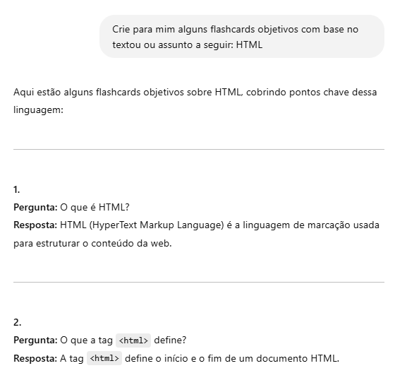

3. **Solicite o arquivo CSV:** "Preciso que você insira esses flashcards em formato CSV sendo a pergunta a primeira coluna e a resposta a segunda coluna, use ponto e vírgula para separar uma coluna da outra."

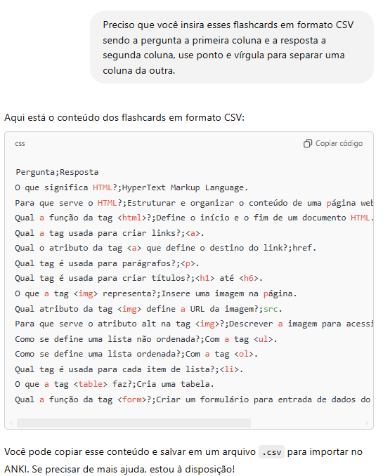

Com isso, a OpenAI retornará perguntas e respostas sobre HTML que podem ser importadas para o ANKI de forma organizada e pronta para estudo.

### Como Inserir os Códigos Gerados pelo OpenAI no ANKI

Após o ANKI gerar a lista com os códigos separados por ponto e vírgula (";"), siga estas etapas:

1. **Crie um novo documento de texto:** Abra um editor de texto.

2. **Insira a lista gerada no OpenAI:** Copie os flashcards gerados e cole no documento de texto.

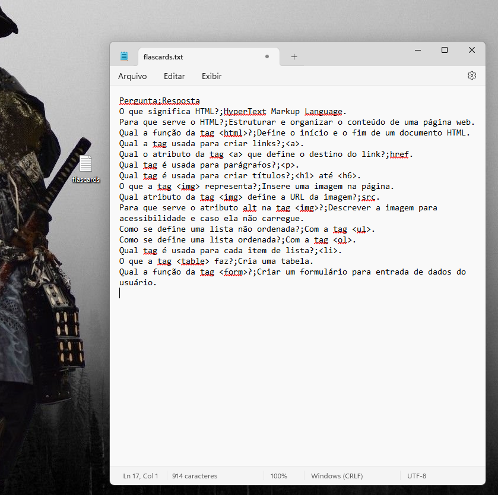

3. **Salve o arquivo como CSV:** Vá em "Salvar Como" e insira o nome do arquivo seguido de ".csv" (por exemplo, "flashcards.csv").

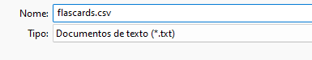
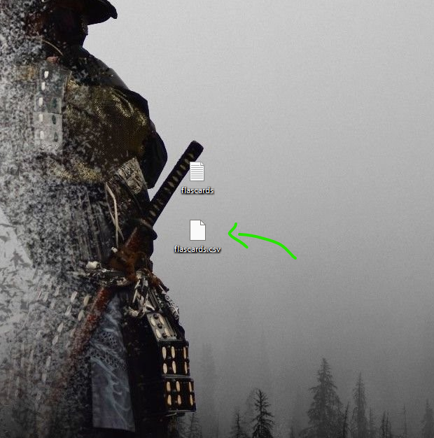

4. **Importando no ANKI:**

- Abra o ANKI.

- Selecione "Importar" e escolha o arquivo CSV que você criou.

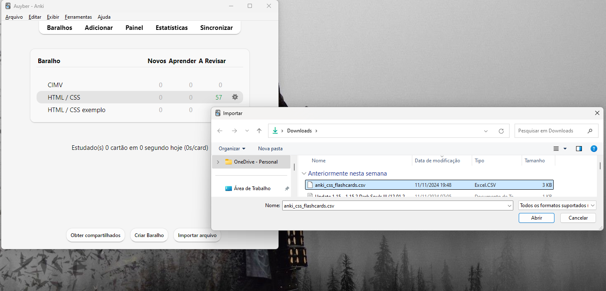

- Escolha o baralho para o qual deseja importar os flashcards.

- Confirme se o separador de campo está configurado como ponto e vírgula.

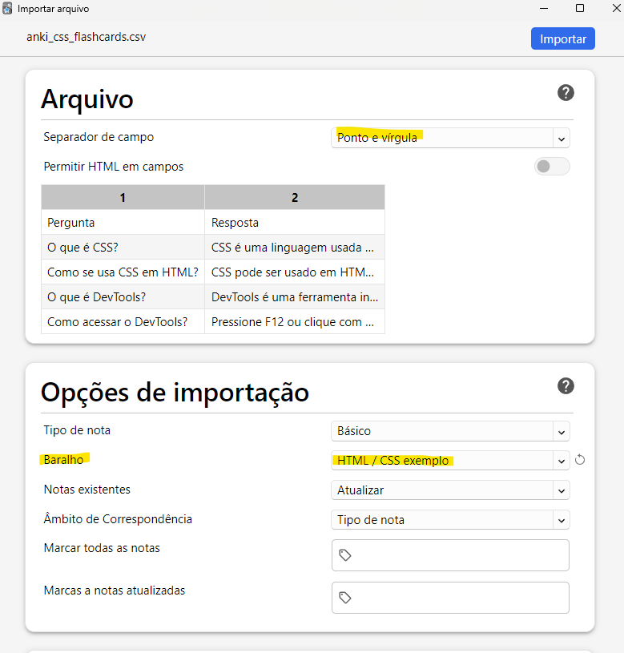

- Clique em "Importar" para concluir o processo.

Após isso, você estará pronto para começar a revisar os flashcards gerados diretamente no ANKI.

### Exemplo Pessoal de Estudo

Conforme vou avançando na trilha de estudo, eu utilizo o Notion, e nele vou fazendo anotações, como dicas, atalhos e tópicos. Depois, crio os flashcards com base nesses tópicos. Essa abordagem me ajuda a revisar e consolidar o que aprendo de maneira eficiente.

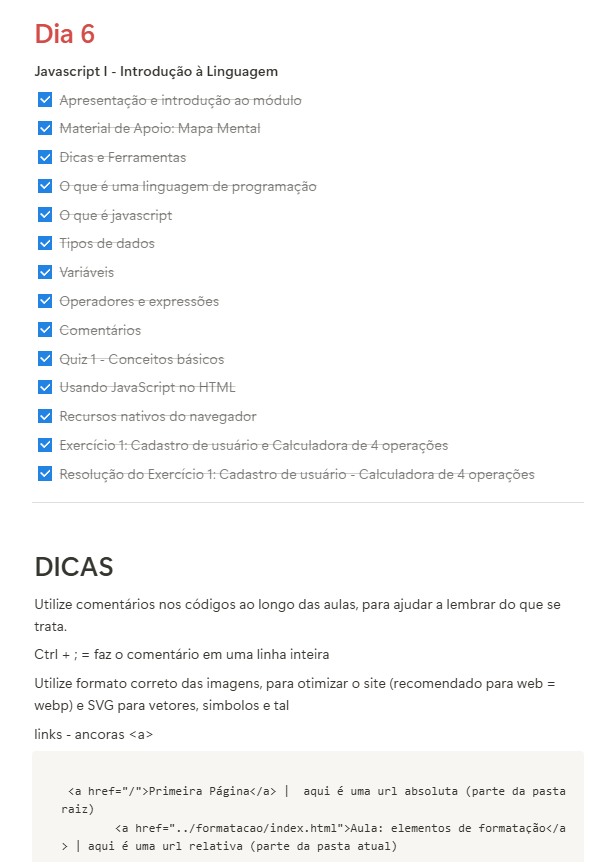

Conclusão

Usar a OpenAI como suporte para criar flashcards no ANKI pode transformar sua forma de estudar, poupando tempo e permitindo que você se concentre no aprendizado. Experimente esses prompts para agilizar seus estudos e aproveite a praticidade do CSV para importar os cartões diretamente. 🚀

---

## Usando IA como Ferramenta de Aprendizado na Programação

Enquanto resolvia um exercício de uma das trilhas de estudos que estava fazendo, me deparei com um desafio interessante. O exercício pedia para criar um programa que calculasse a área de diferentes formas geométricas. Escrevi o código principal usando do, switch e while, e também criei minha primeira função para calcular a área de um triângulo.

Porém, quando cheguei no case 1 do switch e precisava conectar os prompts para base e altura com a função que eu tinha escrito, fiquei travado. Eu sabia exatamente o que precisava ser feito, mas não tinha certeza de como estruturar o código corretamente.

Foi aí que decidi usar a IA como uma aliada. Em vez de pedir o código pronto, expliquei meu raciocínio, compartilhei o que já havia feito e pedi ajuda para entender como estruturar o pensamento. A IA me guiou, sugeriu ajustes e me ajudou a compreender melhor o caminho para implementar a lógica.

Essa abordagem me mostrou como usar ferramentas como a IA para melhorar o aprendizado, e **não apenas obter respostas.** Pedir ajuda para refinar o raciocínio é uma forma poderosa de aprender e evitar atalhos que comprometem o crescimento.

Então, fica a dica:
👉 Use a IA como uma parceira no aprendizado. Explique seu raciocínio, peça feedback e aprenda com o processo. Assim, você desenvolve suas habilidades **sem se tornar dependente de soluções automáticas.**

---

Boa sorte e bons estudos!
